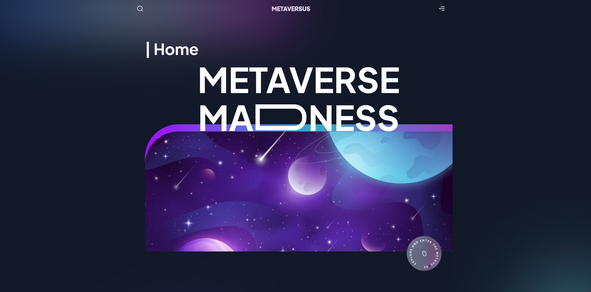

# <div align="center">Metaversus NextJS Website</div>


## About the Project

Next based website for Metaverse built with Framer Motion

## Features

- 🎨 Tailwind CSS: Leveraging Tailwind CSS for highly customizable and responsive UI designs with minimal effort.
- 🕹️ Framer Motion: Implementing Framer Motion for smooth and interactive animations, enhancing user experience.
- 🌐 Netlify Deployment: Ensuring fast, secure, and reliable hosting with Netlify, featuring continuous deployment and seamless integration.
- 📦 Component-Based Architecture: Utilizing modern frontend frameworks for modular, reusable, and maintainable code.


## Tech Stack

<div align="center">
  


</div>

## Project Structure
```bash
├───app
├───components
├───data
├───public
└───utils
```

## Installation
To run this project locally, follow these steps:

1. **Clone the repository**
   ```bash
   git clone https://github.com/mabedd/Metaversus-Website.git

2. **Navigate to the project directory**
   ```bash
   cd Metaversus-Website

3. **Install Dpendencies**
   ```bash
   npm install

 4. **Start the App**
     ```bash
     npm run dev
    ```


<div align="center">
  <p>Made with ❤️ by Mohammed</p>
</div>
